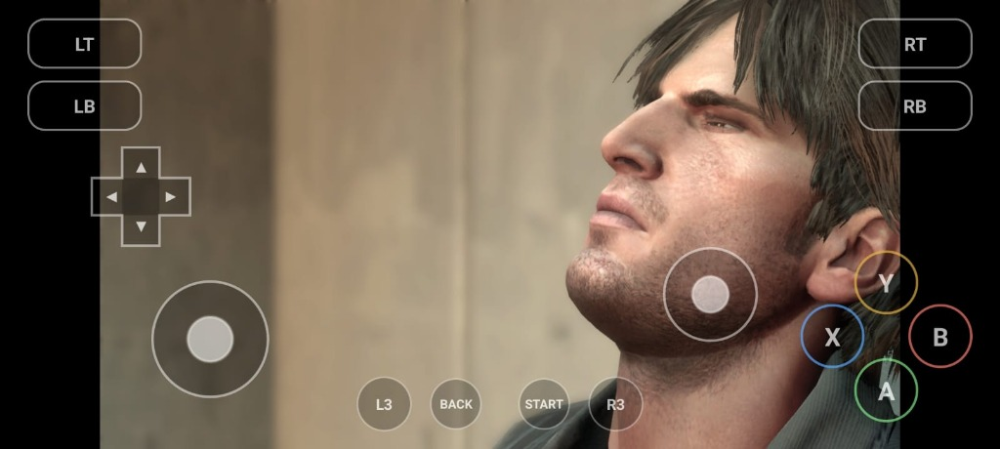
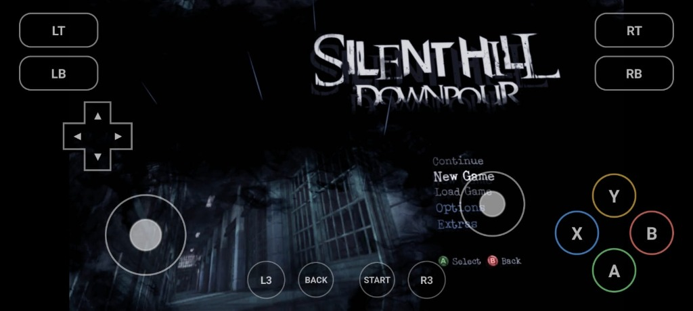
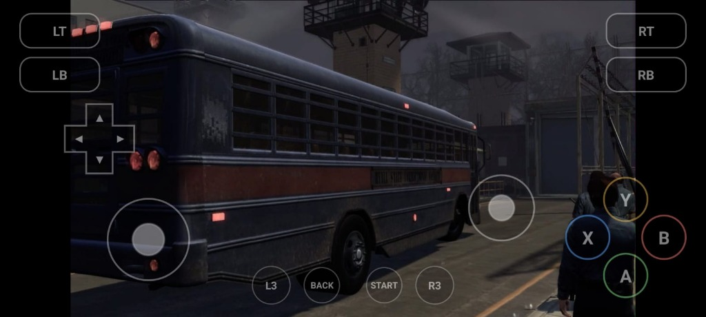

<div align="center">

# 🌧️ Silent Hill: Downpour — Android Port (DownpourRecomp)

### Jogue *Silent Hill: Downpour* nativamente no Android via recompilação estática (C++ / ARM64) e Vulkan — sem emuladores pesados.

[](https://github.com/WINDROID-EMU/Silent-Hill-Downpour-port-android/releases)
[-3DDC84?style=for-the-badge&logo=android&logoColor=white)](https://github.com/WINDROID-EMU/Silent-Hill-Downpour-port-android/releases)
[](https://www.vulkan.org/)
[](LICENSE)



## [⬇️ Baixar APK na aba Releases](https://github.com/WINDROID-EMU/Silent-Hill-Downpour-port-android/releases)

</div>

---

## 📸 Capturas de Tela no Android

<div align="center">

| Menu Inicial (com Overlay de Controles) | Cena Inicial — Murphy Pendleton |
| :---: | :---: |
|  |  |

| Gameplay — Pátio da Prisão / Ônibus |
| :---: |
|  |

</div>

---

## 📌 Sobre Este Projeto (Fork para Android)

Este repositório é um **fork focado na plataforma Android** do projeto original [DownpourRecomp](https://github.com/LittleBitUA/DownpourRecomp), criado por **[LittleBitUA](https://github.com/LittleBitUA)** (que originalmente portou o jogo de Xbox 360 para Windows PC).

### Origem e Créditos
* **Projeto Original (PC Windows):** [LittleBitUA/DownpourRecomp](https://github.com/LittleBitUA/DownpourRecomp) por **LittleBitUA**.
* **Companion SDK (Xbox 360 Host Runtime):** [LittleBitUA/rexglue-sdk-dpour](https://github.com/LittleBitUA/rexglue-sdk-dpour) e a equipe do [ReXGlue SDK](https://github.com/rexglue/rexglue-sdk).
* **Base de Emulação GPU / Shaders:** Agradecimentos à equipe do [Xenia](https://github.com/xenia-canary/xenia-canary).
* **Port e Adaptação para Android:** Desenvolvido por **[WINDROID-EMU](https://github.com/WINDROID-EMU)**.

> [!IMPORTANT]
> **Aviso Legal:** Este repositório **NÃO contém nenhuma ROM, ISO, executável extraído, asset, textura, música ou código proprietário da Konami ou Vatra Games.**
> O usuário deve fornecer sua própria cópia legalmente adquirida do jogo (*Silent Hill: Downpour* — Xbox 360, Title ID `4B4E0823`).

---

## 📱 O que mudou em relação à versão original de Windows?

Originalmente, o projeto DownpourRecomp foi projetado exclusivamente para executar em computadores **Windows 10/11 x86-64** usando DirectX 12 e teclado/mouse/XInput.

Neste fork, toda a arquitetura foi portada e adaptada para dispositivos móveis **Android (ARM64-v8a)**:

1. **Backend Gráfico em Vulkan:**
   - Adaptação do pipeline gráfico para **Vulkan** com suporte a dispositivos móveis.
2. **Suporte a Drivers Customizados (AdrenoTools / Turnip):**
   - Integração completa com `libadrenotools` para carregamento de drivers **Mesa Turnip** em chips Qualcomm Snapdragon, resolvendo incompatibilidades e falhas de renderização.
   - Proteção do handle do Vulkan contra `dlclose` acidental no Android 15.
3. **Pipeline Android Nativo (JNI / NDK):**
   - Camada em C++23 com NDK r28, integrando o ciclo de vida do Android via JNI.
   - Gerenciador de armazenamento adaptado ao armazenamento interno e com Scoped Storage.
4. **Otimizações de Desempenho para CPUs Mobile:**
   - Compilação com **ThinLTO** (`-flto=thin`), `-O3`, e vetorização SLP.
   - **Gerenciamento Inteligente de Afinidade de Threads:** Correção de concorrência e escalonamento para arquiteturas big.LITTLE / Prime cores (evitando starvation em threads de streaming e texturas).
   - **Lock de Taxa de Atualização Dinâmica:** Detecção da melhor taxa de atualização (60Hz, 90Hz, 120Hz) preservando a resolução nativa da tela do aparelho.
5. **Integração Completa de CI/CD (GitHub Actions):**
   - Compilação automatizada do APK Android e publicação automática de releases via GitHub Actions.

---

## ⚙️ Requisitos do Sistema (Android)

* **Arquitetura:** `arm64-v8a` (64-bit obrigatório).
* **Versão do Android:** Android 8.0 (Oreo) ou superior (API 26+). Recomendado Android 11+.
* **GPU / Driver:** GPU com suporte completo a **Vulkan 1.1+**.
  * Em processadores **Snapdragon**, o uso de drivers **Mesa Turnip** customizados é altamente recomendado para melhor fidelidade gráfica e performance.
* **Memória RAM:** Mínimo de 6 GB de RAM (recomendado 8 GB ou mais).
* **Espaço de Armazenamento:** Cerca de 6 a 8 GB livres para os dados do jogo.

---

## 🎮 Como Instalar e Jogar

1. Baixe o APK mais recente na aba [Releases](https://github.com/WINDROID-EMU/Silent-Hill-Downpour-port-android/releases).
2. Instale o APK no seu dispositivo Android e conceda as permissões de armazenamento solicitadas.
3. Obtenha a sua cópia legal do *Silent Hill: Downpour* (Xbox 360).
4. No primeiro início, o aplicativo permitirá selecionar a imagem/arquivos do jogo para descompactação e configuração inicial dos diretórios de dados.
5. Configure os controles na tela ou conecte um gamepad Bluetooth / USB (Xbox, DualShock, DualSense, etc.).

---

## 🛠️ Compilando o Projeto a partir do Código-Fonte

### Pré-requisitos
* **Linux** ou **macOS** (ou WSL2 no Windows).
* **Android Studio / Android SDK** com:
  * NDK versão `28.2.13676358` ou superior
  * CMake `3.22.1` ou superior
* **JDK 17** (Temurin recomendado).
* Git com suporte a submódulos.

### Passo a passo

```bash
# 1. Clonar o repositório com submódulos recursivos
git clone --recursive https://github.com/WINDROID-EMU/Silent-Hill-Downpour-port-android.git
cd Silent-Hill-Downpour-port-android

# 2. Entrar na pasta Android
cd src/android

# 3. Dar permissão de execução ao Gradle Wrapper
chmod +x gradlew

# 4. Compilar o APK (Debug ou Release)
./gradlew assembleDebug
```

O APK gerado estará disponível em:
`src/android/app/build/outputs/apk/debug/app-debug.apk`

---

## 👥 Agradecimentos e Créditos

* **[LittleBitUA](https://github.com/LittleBitUA)** — Autor e desenvolvedor original do [DownpourRecomp](https://github.com/LittleBitUA/DownpourRecomp) para PC e maintainer do fork do SDK para Downpour.
* **[Alexbeav](https://github.com/Alexbeav)** — Desenvolvedor do instalador original de imagem de disco.
* **Equipe ReXGlue / Xenia** — Pelas bases do runtime estático de Xbox 360 e emulação gráfica.
* **Equipe Mesa / Turnip & Bylaws (libadrenotools)** — Pelo suporte a drivers Vulkan customizados no ecossistema Android.
* **Comunidade N64Recomp** — Pelos pioneirismos e avanços na engenharia reversa de recompilação estática.

---

## ⚖️ Licença

O código-fonte do invólucro do host e ferramentas de compilação é licenciado sob a licença **BSD 3-Clause** — consulte o arquivo [LICENSE](LICENSE) para mais detalhes.

O código recompilado derivado do binário do jogo e todos os materiais intelectuais de *Silent Hill: Downpour* pertencem à **Konami Digital Entertainment** e **Vatra Games**.
