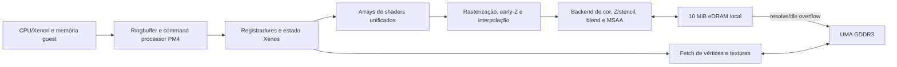
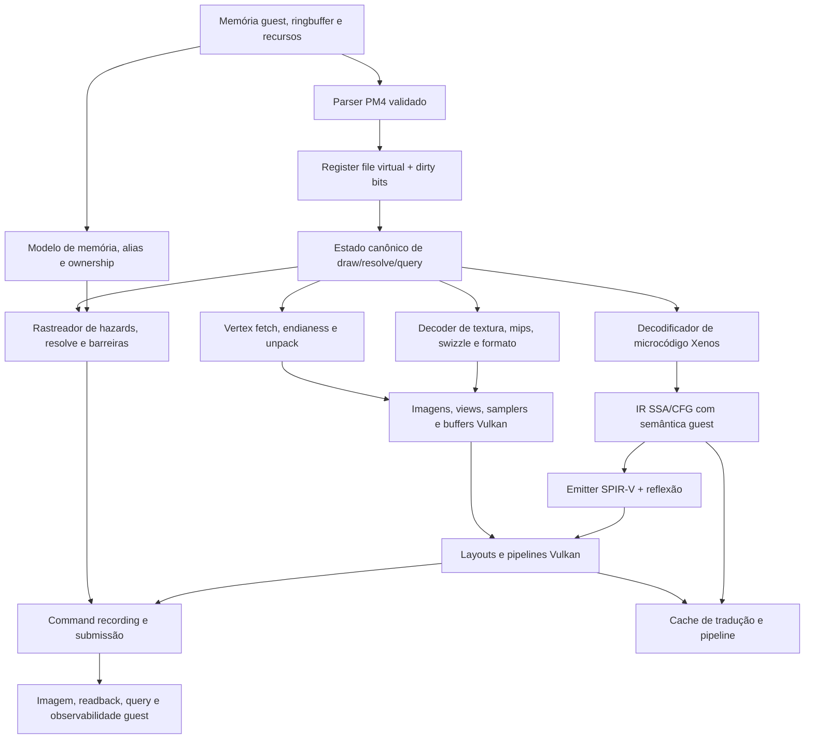

# GPUs Adreno 619–8xx e GPU Xenos do Xbox 360: arquitetura, Vulkan, texturas e roteiro de compatibilidade

> **Tese fundamental.** Não é possível melhorar fisicamente uma GPU Adreno para que ela se torne uma Xenos. São projetos diferentes, com memória, backend de rasterização, formatos, registradores, ISA, sincronização e contratos de API distintos. O caminho tecnicamente correto é **tradução**, **emulação** ou **port/recompilação**. Este documento descreve como construir essas camadas sem confundir uma analogia arquitetural com equivalência de hardware.

## Resumo executivo

A Xenos do Xbox 360 combina um die principal de shaders unificados com um backend associado a aproximadamente 10 MiB de eDRAM. A memória local absorve color, depth/stencil, blending e MSAA; a GDDR3 compartilhada fornece texturas, vértices, código e buffers resolvidos. A documentação histórica descreve três arrays SIMD de 16 ALUs, 16 unidades de fetch de textura filtrado, 16 unidades de fetch de vértice e um backend resumido como oito escritas de pixel por ciclo. Alguns números detalhados vêm de análises técnicas e engenharia reversa, não de uma especificação pública completa da ATI, e devem ser tratados com essa ressalva. [21] [22] [23]

A Adreno 619 é uma GPU móvel de uma plataforma com memória LPDDR4x compartilhada. A Qualcomm publica para o Snapdragon 750G suporte a Vulkan 1.1, OpenGL ES 3.2, OpenCL 2.0 FP e DirectX 12, mas não publica, nessa ficha, contagem de ALUs, clock absoluto, cache ou “VRAM” separada. A arquitetura Adreno é descrita como shader unificado e escalar, com renderização baseada em tiles, GMEM e compressão UBWC. [1] [2] [3] [4]

As famílias posteriores não devem ser tratadas como uma escala uniforme. A associação entre Snapdragon 8 Gen 1 e “Adreno 730”, entre Snapdragon 8 Gen 2 e “Adreno 740” e entre Snapdragon 8 Gen 3 e “Adreno 750” é útil como nomenclatura técnica, mas a Qualcomm frequentemente chama a GPU apenas de **Adreno** em suas páginas. A arquitetura oficialmente chamada de *sliced architecture* aparece no Snapdragon 8 Elite; contagens de slices, ALUs e pipelines publicadas por fontes independentes são estimativas ou observações de dispositivos específicos, não especificações universais. [5] [7] [8] [9] [17] [18] [19]

Uma implementação prática deve manter duas rotas explícitas:

1. **Emulação fiel:** consome o ringbuffer/PM4, mantém registradores virtuais, modela memória guest, EDRAM, resolves, predicação, queries, memexport e observabilidade de ordem. É a rota de maior compatibilidade e maior custo.
2. **Port ou recompilação:** transforma shaders, estados, vértices, texturas e chamadas do jogo para uma implementação Vulkan específica. Pode ser muito mais rápida, mas depende de hipóteses por título e não constitui compatibilidade genérica com qualquer jogo Xbox 360. O projeto XenosRecomp documenta precisamente essa natureza específica por projeto. [24] [25]

Vulkan é um backend apropriado, mas não uma camada automática de compatibilidade. O módulo entregue a `vkCreateShaderModule` é SPIR-V binário, e cada capability, recurso, limite, layout, acesso e dependência precisa ser aceito pelo dispositivo. O tradutor deve consultar `VkPhysicalDeviceProperties2`, `VkPhysicalDeviceFeatures2`, extensões, formatos e propriedades de subgrupo em tempo de execução. Uma versão nominal de Vulkan, sozinha, não prova que descriptor indexing, buffer device address, robustez, dynamic rendering ou uma extensão de Adreno estejam disponíveis. [26] [27] [28] [29]

O primeiro objetivo deve ser uma referência correta e lenta. Depois, o projeto pode ativar render passes eficientes, attachments transitórios, caches, batching, indirect draws, variantes de precisão e recursos opcionais do dispositivo, sempre com comparação diferencial contra a referência.

## Escopo e terminologia

O escopo é a camada gráfica que recebe comandos e recursos de um software Xbox 360 e os executa em uma Adreno por Vulkan. Isso **não** substitui a emulação do processador Xenon, do sistema operacional, da ABI, do gerenciamento geral de memória ou dos serviços do console. Em uma emulação completa, essa camada é um subsistema do emulador. Em um port, é um renderer adaptado ao jogo.

| Termo | Definição operacional neste documento | Cuidado necessário |
|---|---|---|
| **Xenos** | GPU ATI/Microsoft do Xbox 360, com shaders unificados, memória UMA e eDRAM local para o backend. | Não é simplesmente uma GPU Direct3D 9 de PC; o Xbox usa extensões de console, resolves e formatos próprios. [22] [23] |
| **Adreno 619** | Nome comercial da GPU associada ao Snapdragon 750G. | A ficha do SoC não fornece uma microarquitetura completa nem uma contagem pública de unidades. [1] [2] |
| **A6xx, A7xx, A8xx** | Rótulos de família usados em documentação de drivers, fontes técnicas e nomenclatura de mercado. | Não constituem um contrato Vulkan único. SKU, firmware, driver e dispositivo devem ser identificados em runtime. [16] [45] |
| **UMA** | Memória compartilhada entre CPU e GPU. | Compartilhada não significa que todos os acessos tenham a mesma latência ou largura de banda. |
| **eDRAM** | Memória física local da Xenos para operações de framebuffer. | Não é equivalente a um `VkMemoryHeap` nem pode ser “alocada” diretamente em uma Adreno. |
| **GMEM** | Memória local/cache usada pela renderização tiled da Adreno. | O driver decide a organização; o aplicativo comunica intenções por attachments, passes e operações load/store. [3] [4] |
| **Resolve** | Conversão, normalmente de uma superfície multisample para uma superfície single-sample ou de um target local para memória observável. | Em Xenos pode ser um evento arquitetural importante; em Vulkan deve haver estado, layout e sincronização explícitos. |
| **Guest** | Estado e memória observáveis pelo programa Xbox 360. | Uma tradução correta preserva semântica guest, não apenas uma imagem semelhante. |
| **IR** | Representação intermediária própria para shaders, recursos e estados. | Deve ficar separada do backend SPIR-V para permitir testes e múltiplos backends. |
| **PM4** | Famílias de pacotes/comandos usadas no command processor Xenos. | O parser precisa validar limites, tipos e endereços antes de traduzir. [23] [24] |

### Classificação das afirmações

As seções usam três rótulos implícitos ou explícitos:

- **Confirmado:** publicado pela Qualcomm, Khronos, Microsoft/IEEE ou documentado de forma verificável no código e na engenharia reversa citados.
- **Estimativa/observação:** medido por uma fonte independente, reconstruído por engenharia reversa ou dependente de aparelho, driver ou benchmark.
- **Proposta:** decisão de desenho, fallback ou estratégia recomendada para o tradutor; não é uma propriedade do hardware.

A ausência de um recurso em uma ficha comercial não prova sua ausência física. Significa apenas que ele não foi confirmado pela fonte consultada.

## Tabela comparativa

| Aspecto | Xenos do Xbox 360 | Adreno 619 | Adreno 6xx em geral | Adreno 7xx | Adreno 8xx / gerações recentes |
|---|---|---|---|---|---|
| Contexto | GPU de console, projetada para uma plataforma fixa. | GPU de SoC móvel intermediário, associada ao Snapdragon 750G. | Família heterogênea; A619 é agrupada pelo Freedreno entre A6xx gen1. [16] | Família heterogênea; algumas associações numéricas são secundárias e alguns produtos usam apenas “Adreno”. | A Qualcomm publica recursos de geração e arquitetura, mas nem sempre o identificador numérico da GPU. |
| Organização | Três arrays SIMD de 16 ALUs, com shaders unificados; a descrição tradicional totaliza 48 ALUs FP32 e também usa a convenção “240 5D/shading units”. [21] [22] | Shader unificado e escalar; threads são processadas em grupos de quatro segundo a documentação Adreno. [3] | Mesmo princípio geral, com diferenças por SKU e driver. | Aumentos de desempenho são publicados como comparação de geração, não como contagem universal de unidades. [5] [6] [7] [12] | O 8 Elite introduz oficialmente *sliced architecture*; a quantidade de slices e processadores não é publicada na ficha oficial. [9] |
| Memória | 512 MiB GDDR3 UMA, 128 bits e 22,4 GB/s teóricos; 10 MiB de eDRAM para o backend. [21] [22] | LPDDR4x compartilhada com o SoC; a ficha indica interface 2 × 16 bits, até 2.133 MHz e até 12 GB de RAM de plataforma. [2] | UMA e GMEM variáveis; Mesa descreve GMEM aproximadamente entre 128 KiB e 1 MiB conforme SKU, não como ficha oficial para cada GPU. [16] | UMA; capacidades reais dependem do aparelho, memória e driver. | A Qualcomm descreve memória dedicada por slice no Snapdragon 8 Gen 5, mas não informa capacidade ou número de slices. [11] |
| API publicada | Variante Xbox de Direct3D 9.0c/9_3, com extensões de console. | Vulkan 1.1, OpenGL ES 3.2, OpenCL 2.0 FP e DirectX 12 no Snapdragon 750G. [1] | Turnip é documentado pela Mesa como driver Vulkan 1.3 para Adreno 6xx, mas features e versões efetivas dependem de software. [16] | Exemplos oficiais listam Vulkan 1.1 ou 1.3 conforme a plataforma. [5] [7] [13] [14] | Exemplos recentes listam Vulkan 1.3; a presença prática de extensões deve ser consultada no dispositivo. [9] [10] [11] |
| Backend de pixels | Color, Z/stencil, blending e MSAA ficam próximos da eDRAM; a listagem histórica usa oito escritas de pixel por ciclo. [21] [22] | Renderização predominantemente tiled, com bins, GMEM e caminho alternativo sysmem. [3] [16] | Tile size e caminho efetivo são dependentes do driver. | Não se deve mapear diretamente tiles Xenos para tiles Adreno. | A arquitetura recente pode acrescentar recursos de tile memory, mas eles não são requisito geral do tradutor. |
| RT | Não é uma característica equivalente ao ray tracing moderno. | Não confirmado pela ficha do 750G. | Depende da geração; não inferir da família. | Ray tracing acelerado por hardware é explicitamente reivindicado para a geração associada à Adreno 740. [7] | Snapdragon 8 Gen 3 e gerações posteriores publicam recursos de ray tracing; pipelines e queries continuam condicionados a features e driver. [8] [9] |
| Texturas | DXTC/S3TC, variantes ATI2N/3Dc e formatos específicos documentados por fontes de engenharia reversa. [22] [23] | Deve usar apenas formatos e usos confirmados por `vkGetPhysicalDeviceFormatProperties2`. | Qualcomm publica tabelas multidimensionais para formatos, layout, UBWC, render target e MSAA. [20] | Maior conjunto pode existir, mas não é uniforme entre produtos. | O nome da família não substitui enumeração de formatos, extensões e propriedades. |
| Nível de evidência | Mistura de documentação histórica e engenharia reversa. | Identificação e APIs básicas oficiais; microarquitetura detalhada não publicada. | Driver aberto ajuda a caracterizar alguns dispositivos, sem ser contrato universal. | Percentuais oficiais são relativos à geração anterior; benchmarks independentes são observações de aparelhos. | Arquitetura e percentuais oficiais coexistem com identificadores e contagens secundários. |

### Cautelas sobre a nomenclatura Adreno

A expressão **Adreno 619** tem uma referência comercial clara no Snapdragon 750G. Já “A6xx” é um rótulo de família útil para drivers, não uma especificação de todas as variantes. O arquivo de dispositivos do Freedreno agrupa IDs 615, 616, 618 e 619 como A6xx gen1 e registra parâmetros que orientam o driver, como alinhamento de tile e granularidade de wave; esses dados não devem ser convertidos em limites Vulkan universais. [16]

“Adreno 730”, “Adreno 740” e “Adreno 750” são associações técnicas comuns com determinadas plataformas Snapdragon. A Qualcomm publica, por exemplo, o Snapdragon 8 Gen 1 como uma GPU Adreno re-arquitetada e publica percentuais de desempenho, mas a página não precisa usar o identificador “730”. O mesmo cuidado vale para a associação do Snapdragon 8 Gen 3 à Adreno 750. [5] [7] [8] Fontes de benchmark podem registrar clocks observados e médias agregadas, porém isso não é uma frequência universal do silício. [17] [18]

Para as gerações 8xx, o termo deve ser ainda mais conservador. A Qualcomm chama a arquitetura do Snapdragon 8 Elite de *sliced architecture* e descreve processadores shader independentes, mas não publica quantidade de slices, ALUs ou cache na ficha. Uma fonte secundária associa o produto à Adreno 830 e relata valores observados/estimados; estes devem permanecer marcados como independentes. [9] [19] Para a compatibilidade, o identificador decisivo é a combinação de `vendorID`, `deviceID`, `driverID`, versão do driver, UUID e features, não o sufixo “8xx”.

## Xenos: arquitetura e eDRAM

### Organização física e memória

A Xenos original foi descrita como um pacote com dois dies de 90 nm, ambos operando a 500 MHz em descrições contemporâneas: um die principal de lógica e shaders e um die de eDRAM fabricado separadamente. O die de eDRAM abriga o caminho de saída de cor, Z/stencil, blending e a lógica de FSAA/MSAA. [21] [22] Esses valores são fatos históricos de fontes técnicas, mas não devem ser usados para inferir o comportamento de uma Adreno atual.

O Xbox 360 usa UMA: CPU e GPU compartilham 512 MiB de GDDR3, com interface de 128 bits e largura de banda teórica de 22,4 GB/s. A Xenos também participa do papel de northbridge/controladora. A eDRAM fornece aproximadamente 10 MiB de framebuffer local e uma largura de banda interna reportada em torno de 256 GB/s no caminho ROP–eDRAM; a conexão entre dies é descrita em torno de 32 GB/s. [21] [22]

A consequência é importante: a eDRAM não substitui a memória do sistema. Texturas, vértices, código, buffers e superfícies resolvidas continuam na GDDR3. A eDRAM reduz o custo dos acessos repetitivos de color/depth/stencil e do blending. Se os attachments excedem sua capacidade, o renderizador precisa dividir a área em tiles e resolver cada região.

### Shaders, textura e rasterização

A descrição histórica mais usada organiza os shaders unificados em três arrays SIMD de 16 ALUs, totalizando 48 ALUs de ponto flutuante. Cada ALU pode emitir uma operação vetorial Vec4 e uma escalar no mesmo ciclo, razão pela qual algumas tabelas usam a nomenclatura 5D ou 240 unidades de shading. Essa convenção não é diretamente comparável a “cores” de uma Adreno. [21] [22]

A Xenos pode atribuir os arrays dinamicamente a vertex shaders, pixel shaders ou a uma mistura dos dois. Essa é uma forma de shader unificado: não há uma partição fixa que reserve todo o hardware para um estágio.

O bloco de textura é descrito com 16 unidades de fetch filtrado, com LOD e filtragem, e 16 unidades de fetch de vértice não filtrado. Bilinear normalmente requer uma operação por unidade; trilinear e anisotrópico exigem mais amostras e ciclos. Esses números pertencem à descrição histórica da Xenos e não devem ser usados como uma tabela de equivalência com unidades de textura Adreno. [21] [22]

Fontes técnicas descrevem o scan converter formando blocos de 8 × 8 pixels e uma etapa de early hierarchical-Z. O cabeçalho de engenharia reversa do Xenia contém estados e formatos necessários para reproduzir a semântica observável, mas não constitui uma ISA oficial completa publicada pela ATI. [23] [24]

### Backend, MSAA e tiling

O backend é frequentemente resumido como oito ROPs ou oito escritas de pixel por ciclo. Em condições específicas, quando não há operação de cor, a taxa de Z pode ser maior. Com 4x MSAA, a documentação histórica descreve até 32 amostras de cor ou 64 operações de Z/stencil por ciclo, mas essa formulação não deve ser confundida com oito unidades completas de shader. [21] [22]

A eDRAM suporta 1x, 2x e 4x MSAA em descrições de engenharia reversa, com padrão de amostras fixo. A eDRAM mantém as amostras, executa testes de profundidade e stencil, faz blending e resolve a cor ao final do tile ou do frame. Alpha-to-mask é outra operação relevante para transparência independente de ordenação. [23]

O tiling da Xenos é uma resposta à capacidade fixa da eDRAM. Ele não é automaticamente equivalente a um TBDR móvel moderno. Xenos pode repetir parte da transformação e do setup da geometria quando a geometria cruza regiões, enquanto tilers móveis normalmente fazem binning e depois um render pass local por tile. A analogia correta é “manter color/depth próximo do rasterizador”; a organização, o controle e o custo são diferentes. [22] [40] [52]

O cabeçalho `xenos.h` do Xenia modela os 10 MiB como 2.048 tiles de amostras MSAA de 32 bpp, com unidade-base de 80 × 16 amostras. Para um target de 32 bpp, isso resulta em uma granularidade aproximada de 80 × 16 pixels sem MSAA, 80 × 8 em 2x e 40 × 8 em 4x. Para 64 bpp, o consumo dobra. Esses valores são documentação de emulador/engenharia reversa e devem ser usados como hipótese testável, não como manual público da ATI. [23]

### Formatos de render target e shaders

A reconstrução de formatos de render target inclui 8_8_8_8, variantes gamma, 2_10_10_10 inteiro, 2_10_10_10 float, formatos 16_16 e 16_16_16_16 fixos e float, 32_FLOAT, 32_32_FLOAT, D24S8 e D24FS8. A codificação de alguns formatos, especialmente 2_10_10_10_FLOAT e D24FS8, requer uma implementação explícita e testes de imagem; não há razão para assumir que um `VkFormat` de nome parecido tenha a mesma representação. [23]

A faixa e a semântica do 2_10_10_10_FLOAT aparecem com descrições divergentes em fontes técnicas, inclusive quanto ao sinal. A implementação deve escolher uma convenção baseada no comportamento de referência do jogo e documentar a decisão. Não se deve declarar uma faixa única como fato universal sem indicar a convenção usada.

A API de programação é uma variante Xbox de Direct3D 9.0c, identificada no XDK como 9_3, com extensões como predicated tiling, procedural synthesis, operações de resolve e memexport. Os assemblers `xvs_3_0` e `xps_3_0` produzem microcódigo específico. Tabelas comunitárias de opcodes são incompletas; o tradutor deve aceitar que a ISA precisa ser inferida e validada por traces. [23] [24]

## Pipeline gráfico: Xenos versus Adreno/Vulkan

O pipeline conceitual pode ser resumido assim:



Na Adreno, a rota aproximada é diferente:


| Evento ou conceito guest | Tradução Vulkan proposta | Limite da equivalência |
|---|---|---|
| Pacote PM4 | Parser determinístico que atualiza um register file virtual. | `vkCmd*` não reproduz o timing do command processor. |
| Vertex shader/pixel shader Xenos | IR própria seguida de SPIR-V para `VK_SHADER_STAGE_VERTEX_BIT` e `VK_SHADER_STAGE_FRAGMENT_BIT`, ou fetch em shader quando necessário. | Semânticas de predicado, kill, precisão e memexport precisam ser lowerizadas. |
| Shaders unificados | Pipelines Vulkan separados por estágio, compartilhando recursos e contrato de interfaces. | “Unificado” não significa que um shader guest possa ser enviado sem transformação. |
| Render target em eDRAM | Attachment Vulkan, imagem/buffer auxiliar ou caminho de pack/unpack. | eDRAM física fixa não é uma heap Vulkan mapeável. |
| Resolve Xenos | Resolve de attachment, shader de conversão ou cópia, conforme formato e observabilidade. | Um resolve precoce pode mudar performance e até a semântica de alias. |
| Predicação de draw | Conditional rendering, draw indirect com contagem, branch em shader ou fallback CPU. | Nenhum fallback reproduz automaticamente timing ou contadores guest. |
| Query/occlusion | Query pool, instrumentação por passe ou aproximação. | A contagem de samples Vulkan não é automaticamente o contador Xenos. |
| Barreira/evento | `vkCmdPipelineBarrier2`, events, semaphores e fences apenas nos pontos necessários. | Submeter na mesma fila não é uma barreira de memória suficiente. |
| Textura e sampler | Imagem optimal, view, sampler e staging buffer, com pack/unpack quando necessário. | Component swizzle da view não é recodificação física dos bytes. |

## Texturas, formatos, tiling e eDRAM

### Três conceitos que não devem ser misturados

Um **formato de payload** define como os bits representam texels, por exemplo BC1, ETC2, ASTC ou um packed 10:10:10:2. Um **component swizzle** de Vulkan define como a view apresenta R, G, B e A ao shader, podendo selecionar componentes ou constantes zero/um. Um **layout físico** define como os bytes ficam organizados na memória, por exemplo linear ou optimal. São camadas diferentes. A component swizzle não rearranja os bytes armazenados. [36] [37]

`VK_IMAGE_TILING_LINEAR` permite um layout observável por `VkSubresourceLayout`, com `offset`, `rowPitch`, `arrayPitch` e `depthPitch`. `VK_IMAGE_TILING_OPTIMAL` deixa o arranjo dependente da implementação para favorecer o acesso da GPU. O aplicativo não deve mapear uma imagem optimal como se fosse um array C nem tentar impor Morton, Z-order, page tiling ou metadados UBWC. [36] [37]

A estratégia proposta é decodificar o conteúdo guest em uma representação canônica, gerar mips e converter para uma variante suportada pelo alvo. A cópia direta de BCn para ASTC não é válida: os esquemas, footprints e bitstreams são diferentes. É preciso decodificar e reencodar ou usar um transcodificador apropriado, com testes visuais.

### Mips, blocos e sRGB

Para uma cadeia mip convencional, cada dimensão é reduzida por `max(floor(dim/2), 1)`. Uma textura comprimida pode ter dimensões lógicas que não são múltiplas de 4; o armazenamento é arredondado ao footprint do bloco. O cálculo de offsets deve usar o bloco do formato, não o número aparente de pixels. [36] [37] [38]

BC1 usa blocos 4 × 4 de 64 bits. BC2, BC3, BC5, BC6H e BC7 usam blocos 4 × 4 de 128 bits, com semânticas diferentes. ETC2 e EAC também usam blocos 4 × 4; ASTC usa blocos de 128 bits com footprints variados, como 4 × 4 até 12 × 12. A lista de formatos e perfis deve ser consultada no alvo. [39]

Formatos sRGB aplicam decodificação não linear a R, G e B; alpha continua linear. Normal maps, roughness, metalness, IDs, depth e buffers intermediários normalmente devem permanecer em formatos lineares. Essa é uma regra de port e validação de conteúdo, não uma equivalência automática entre o formato Xenos e um `VkFormat`. [36] [39]

### Mapeamento de formatos

| Origem ou uso Xenos | Caminho Vulkan preferencial | Fallback de compatibilidade |
|---|---|---|
| DXTC/S3TC equivalente a BCn | Usar `VK_FORMAT_BC1_*`, `BC2_*`, `BC3_*`, `BC4_*` ou `BC5_*` quando `SAMPLED_IMAGE` e o uso exato forem suportados. | Decodificar para RGBA ou formato de canal em staging; custo de memória e bandwidth aumenta. |
| Normais ATI2N/3Dc/DXN/CTX1 | Mapear para BC5/BC4 ou decodificar por shader conforme o empacotamento real. | Converter offline para uma representação canônica por jogo. |
| ASTC/ETC2 para distribuição móvel | Gerar variante offline e escolher por perfil de formato. | Usar RGBA não comprimido para a rota de referência. |
| 8_8_8_8 e variantes gamma | Usar UNORM ou SRGB de acordo com o espaço de cor real. | Pack/unpack em shader se o canal, swizzle ou gamma não coincidir. |
| 2_10_10_10 e formatos float incomuns | Usar packed Vulkan apenas após validar bits, sinal, faixa e usos. | Armazenar em `R32G32B32A32_SFLOAT` ou buffer e converter em shader. |
| D24S8/D24FS8 | Usar depth/stencil equivalente somente se a semântica e as `formatFeatures` coincidirem. | Separar depth/stencil em imagem ou buffer e executar testes explícitos. |
| EDRAM multisample | Attachment multisample Vulkan, com resolve no mesmo pass quando possível. | Buffer/imagem auxiliar e shader de resolve com comparação contra golden image. |
| UBWC Adreno | Deixar o driver escolher layout optimal e compressão de superfície. | Não tentar produzir UBWC no software; use linear somente para staging quando suportado. |

UBWC não é BCn, ETC2 ou ASTC. É uma compressão/layout proprietário de largura de banda para superfícies, descrito pela Qualcomm para GPUs desde A5x. A presença de UBWC não revela taxa de compressão, largura de barramento nem uma heap acessível ao aplicativo. [3] [4] [20]

### Render targets, samples e localidade

A quantidade aproximada de dados de um attachment é `largura × altura × bytesPorTexel × sampleCount`, acrescida de alinhamento, metadados, outros MRTs e depth/stencil. Esse cálculo é apenas uma estimativa; não modela compressão, fast clear, tile shape ou alocação proprietária.

No Vulkan, imagens multisample têm restrições fortes: `mipLevels` é 1 e o uso é 2D. Em um render pass, attachments de cor e depth/stencil normalmente precisam ter o mesmo sample count, salvo extensões específicas. Um resolve converte a attachment multisample em uma single-sample. [30] [37]

Em arquiteturas tile-based, `LOAD_OP_CLEAR` ou `DONT_CARE`, `STORE_OP_DONT_CARE`, attachments transitórios e resolve no mesmo pass reduzem ida e volta à memória externa. Qualcomm recomenda render passes coerentes, subpasses e invalidação de attachments cujo conteúdo não será usado. Dynamic rendering pode simplificar o gerenciamento, mas não garante que um driver faça a mesma fusão/localidade de um render pass tradicional; isso deve ser medido. [4] [40] [44]

## Vulkan e SPIR-V

### O contrato do módulo

O shader enviado a `vkCreateShaderModule` é SPIR-V. O tradutor deve emitir a menor versão e o menor conjunto de capabilities compatíveis com o perfil do dispositivo. Um módulo que exige SPIR-V ou capabilities de uma versão mais nova não se torna válido apenas porque o backend possui um compilador HLSL. [27] [41]

As interfaces entre estágios precisam declarar `Location`, `BuiltIn`, `DescriptorSet`, `Binding`, `Offset`, `ArrayStride` e `MatrixStride` de modo consistente. Indexação potencialmente divergente precisa de `NonUniform` quando o recurso e a capability permitirem. A reflexão do SPIR-V final deve ser uma etapa obrigatória antes da criação do pipeline. [27] [28]

### Perfil de capabilities por dispositivo

Na inicialização, o tradutor deve capturar pelo menos:

- `apiVersion`, vendor/device IDs, `driverID`, nome e versão do driver;
- `deviceUUID`, `driverUUID` e UUID de pipeline cache;
- extensões enumeradas;
- `VkPhysicalDeviceFeatures2` e `VkPhysicalDeviceProperties2`;
- limites de descriptor sets, samplers, UBO/SSBO, push constants, inputs de vértice e color attachments;
- `dynamicRendering`, `synchronization2`, descriptor indexing, robust buffer access, robustness2 e buffer device address;
- tamanho e operações de subgrupo;
- suporte a formatos, tiling, uso sampled/storage/attachment/transfer e sample counts;
- memory heaps/types, `nonCoherentAtomSize`, `bufferImageGranularity` e, se disponível, orçamento de memória.

Um pseudocódigo de perfil deve se parecer com o seguinte:

```text
profile = query_physical_device()

profile.features = query_features2()
profile.properties = query_properties2()
profile.extensions = enumerate_extensions()
profile.formats = query_required_format_features()

require(profile.core_api >= minimum_api_for_baseline)
require(profile.features.vertexPipelineStoresAndAtomics or enable_guest_memexport_fallback())

if profile.features.dynamicRendering:
    backend.enable_dynamic_rendering = true
else:
    backend.enable_render_pass_objects = true

if profile.features.descriptorIndexing and profile.limits.maxPerStageDescriptorSampledImages >= guest_texture_slots:
    backend.texture_mode = FIXED_OR_INDEXED_DESCRIPTORS
else:
    backend.texture_mode = MATERIAL_SPECIALIZATION_OR_SSBO_FETCH

if profile.features.bufferDeviceAddress:
    backend.address_mode = DEVICE_ADDRESS
else:
    backend.address_mode = DESCRIPTOR_BACKED_BUFFERS

serialize(profile, translator_schema_version)
```

O pseudocódigo é uma proposta. Os requisitos reais devem ser divididos em **baseline obrigatório**, **fallback**, **otimização opcional** e **recurso não suportado**. Não use apenas `apiVersion >= 1.3` como predicado; features e extensões podem ser independentes.

### A619, A7xx e 8xx

Para A619, o baseline conservador é Vulkan 1.1 ou a versão efetivamente exposta pelo driver, SPIR-V simples, descriptor sets fixos, UBO/SSBO, barriers localizadas e fallback sem descriptor indexing avançado. A documentação Mesa caracteriza Turnip como Vulkan 1.3 para Adreno 6xx, mas a implementação real depende da versão do Turnip, firmware e dispositivo. [1] [16]

Para A7xx, recursos adicionais podem existir, mas devem ser ativados por perfil. Ray tracing acelerado por hardware é explicitamente reivindicado na geração associada à Adreno 740; isso não significa que toda GPU 7xx, todo driver Android ou todo pipeline de RT exponha o mesmo contrato. [7]

Para A8xx, a situação deve ser tratada como variável. A fonte consultada sobre Mesa registra suporte inicial Gen8 no Freedreno/Gallium para dispositivos específicos e indica que o suporte Vulkan Turnip estava em evolução. Bibliotecas proprietárias também são pré-compiladas e usadas conforme o pacote do dispositivo. A implementação deve manter um fallback até validar o driver real. [45] [46] [47]

### Descritores, constantes e endereços

O número de layouts e recursos deve respeitar `maxBoundDescriptorSets`, limites por estágio e limites totais. Uma divisão prática é separar recursos estáveis globais, material, texturas/samplers e dados voláteis por draw. [26] [28]

Descriptor indexing e bindless podem reduzir binds, mas são compostos por subfeatures independentes. O tradutor deve consultar update-after-bind, arrays parcialmente ligados, contagem variável, indexação uniforme e indexação não uniforme separadamente. Se a feature faltar, as alternativas são arrays fixos, especialização por material, recompilação ou SSBO com bounds check. [28] [43]

Push constants servem para dados pequenos. O tradutor não deve colocar todos os registradores Xenos nessa área sem verificar `maxPushConstantsSize`. A estratégia documentada pelo XenosRecomp usa constantes e endereços de buffer de forma específica ao projeto; em um tradutor geral, constantes maiores devem ir para UBO/SSBO. [25] [26]

Raw loads e ponteiros exigem buffer device address ou `PhysicalStorageBuffer` quando essa for a estratégia escolhida. Sem a feature, usar descritores. Em ambos os casos, lifetime, alinhamento, layout e sincronização continuam sendo responsabilidade do tradutor. [27] [33]

### Sincronização, queries e robustez

Vulkan não fornece as garantias implícitas do command processor Xenos. Fences comunicam conclusão ao host. Semaphores coordenam filas. Barriers e events ordenam execução e visibilidade dentro da fila. O tradutor deve converter cada dependência guest em `srcStageMask`, `srcAccessMask`, `dstStageMask` e `dstAccessMask` mínimos. [29] [42]

`VK_KHR_synchronization2`, quando disponível, simplifica a geração de dependências por meio de `VkDependencyInfo`. Um fallback temporário de `ALL_COMMANDS` pode ajudar na depuração, mas não deve ser a solução de desempenho, especialmente em uma GPU tile-based. [29] [42]

Occlusion queries Vulkan podem servir para visibilidade, mas não representam automaticamente contadores Xenos de ZPass, ZFail, StencilFail ou pares de contadores. Quando a contagem exata for observável pelo jogo, usar instrumentação por passe, storage buffer ou uma aproximação explicitamente classificada. Resultados imediatos devem ser um caminho lento e sincronizado; não converter cada evento em `vkWaitForFences`. [23] [24] [48]

`robustBufferAccess` e `robustness2` podem ajudar a definir acessos fora do limite, mas possuem custos e semânticas específicas. A evidência do XenosRecomp indica que certos acessos dinâmicos fora do intervalo devem retornar zero. Portanto, o tradutor deve emitir clamp e zero explícitos quando essa semântica for guest-observável, usando robustez como camada adicional, não como substituto. [25] [34]

### Subgrupos, precisão e controle de fluxo

O tamanho e as operações de subgrupo devem ser consultados. Não assumir que o tamanho de wave do Xenos seja o `subgroupSize` do Vulkan. A granularidade de wave registrada no driver Freedreno é um detalhe de hardware/driver, não uma promessa universal da API. Se o shader depender de ballot, shuffle, quad ou operações aritméticas de subgrupo, validar cada estágio e cada operação. [16] [31] [35]

A rota fiel deve começar em FP32, preservar saturação, signed zero, INF, NaN, denormals, conversões e decisões de controle conforme a referência. A Qualcomm recomenda mediump/FP16 em shaders compatíveis para reduzir custo, mas isso é uma otimização dependente de shader, geração e driver. Posição, depth, coordenadas sensíveis a LOD e condições de controle devem permanecer em FP32 até que testes mostrem o contrário. [4] [25]

Controle de fluxo não estruturado pode ser convertido em CFG estruturado. Um fallback com loop de PC e `switch` é geral, mas pode aumentar instruções, registradores e pressão do cache. Flattening só deve ocorrer quando a equivalência for demonstrada. [25]

## Arquitetura em camadas do tradutor

A arquitetura proposta separa compatibilidade semântica de otimização de backend:



### Camada 1: ingestão e validação

O parser deve limitar tamanho de pacote, validar alinhamento, verificar endereços, rejeitar opcodes desconhecidos em modo estrito e preservar um trace reprodutível. O register file virtual mantém dirty bits separados para shaders, constantes, vertex fetch, texturas, samplers, blend, depth/stencil, rasterização, viewport/scissor, render targets, predicação e eventos.

O parser não deve emitir um bind Vulkan para cada registro. Ele atualiza estado sombra e materializa o estado canônico apenas quando um draw, dispatch, resolve, query ou evento o exige.

### Camada 2: estado e memória guest

A camada de memória deve representar buffers, imagens, aliases e ownership de regiões. Um render target Xenos pode ser lido como textura depois de um resolve, reutilizado como outro target ou observado pela CPU. Essas transições precisam de uma máquina de estados, não de uma regra “render target sempre vira imagem Vulkan”.

A eDRAM virtual deve manter a relação entre intervalos, color, depth/stencil, sample count, formato, pitch e resolves. O backend pode usar imagens Vulkan para casos comuns e buffers/storage images com pack/unpack para formatos especiais. A decisão de materializar a memória principal deve ocorrer quando o comando guest a torna observável.

### Camada 3: shaders e IR

A IR própria deve representar:

- operandos, swizzles, write masks e saturação;
- predicados e condições de escrita;
- exportações de cor, depth e memexport;
- fetch de textura, LOD, offsets e cubemap;
- tipos numéricos, conversões e precisão;
- controle de fluxo e loops;
- constantes indexadas e acessos fora do limite;
- contratos de entrada/saída e recursos.

A IR deve possuir um executor CPU de referência ou um intérprete para testes dirigidos. A comparação deve observar registradores e exportações, não apenas a imagem final.

### Camada 4: recursos e texturas

Um descritor de textura guest deve ser normalizado antes de virar `VkImageCreateInfo`. A normalização inclui dimensão, número de mips, layers, sample count, formato, espaço de cor, swizzle, endianess, compressão e uso. O tradutor deve consultar `VkFormatProperties2` para a combinação real de uso e tiling.

Para dados CPU-legíveis, staging buffer ou imagem linear apenas quando suportada. Para amostragem/renderização, imagem optimal e cópia de staging. O layout optimal deve permanecer propriedade do driver.

### Camada 5: pipeline e cache

Um hash de pipeline deve incluir, no mínimo, microcódigo VS/PS, versão da IR, opções de precisão, layout de vertex fetch, formatos/endianess, constantes que alterem controle, layout de descritores, estados de raster/depth/blend, formatos de targets, sample count, resolve, modo semântico e máscara de capabilities.

O cache deve ser dividido em:

1. **Cache de tradução:** microcódigo guest para IR/SPIR-V, com versão do tradutor e opções semânticas.
2. **Cache de objetos:** shader modules, descriptor set layouts, samplers, views, vertex declarations e objetos de render target.
3. **`VkPipelineCache`:** blob opaco do driver, indexado por device UUID, driver UUID, versão, pipeline cache UUID e schema local.

Não reutilizar cegamente um `VkPipelineCache` entre Adreno 619, uma 8xx, versões de driver ou perfis distintos. [32] [51]

### Camada 6: sincronização e submissão

A submissão deve usar allocators lineares por frame, buffers persistentemente mapeados e descritores reutilizáveis quando isso não alterar a semântica. Fences só devem ser aguardadas quando a CPU precisar observar conclusão ou reciclar memória. Barriers devem ser geradas por recurso e acesso. A mesma fila não elimina a necessidade de visibilidade de memória.

## Pseudocódigo de referência

O fluxo principal pode ser descrito assim:

```text
function process_guest_stream(stream, profile):
    while stream.has_packet():
        packet = stream.next_packet()
        validate_packet(packet, profile.guest_address_space)
        state.apply(packet)

        if packet.causes_draw() or packet.causes_resolve() or packet.causes_query():
            canonical = state.materialize_canonical_state()
            handle_canonical_event(canonical, profile)
            state.clear_only_consumed_dirty_bits()

function handle_draw(s, profile):
    mem_plan = memory.resolve_guest_aliases(s.render_targets, s.resources)
    tex_plan = textures.normalize_and_select_formats(s.textures, profile)
    vtx_plan = vertex_fetch.lower(s.vertex_declaration, profile)

    vs_ir = shader_cache.get_or_translate(s.vertex_microcode, VERTEX, s.precision_mode)
    ps_ir = shader_cache.get_or_translate(s.pixel_microcode, FRAGMENT, s.precision_mode)

    vs_spv = spirv_backend.emit(vs_ir, profile, tex_plan, vtx_plan)
    ps_spv = spirv_backend.emit(ps_ir, profile, tex_plan, vtx_plan)
    reflect_and_validate(vs_spv, ps_spv, profile)

    layout = descriptor_manager.get_layout(s, profile)
    pipeline_key = make_pipeline_key(s, vs_spv, ps_spv, layout, profile)
    pipeline = pipeline_cache.get_or_create(pipeline_key)

    transitions = hazard_tracker.transitions_for_draw(mem_plan, tex_plan, s)
    vk.cmd_pipeline_barrier2(transitions)
    vk.bind_pipeline(pipeline)
    descriptor_manager.bind_dirty_ranges(s)
    vk.set_dynamic_state(s.viewport, s.scissor, s.blend_constants)

    if s.predication and profile.conditional_rendering:
        vk.begin_conditional_rendering(s.predicate_buffer)

    issue_draw_or_vertex_fetch_path(s, vtx_plan)

    if s.predication and profile.conditional_rendering:
        vk.end_conditional_rendering()

function handle_resolve(s, profile):
    validate_resolve_format_and_samples(s)
    hazard_tracker.flush_guest_visible_writes(s.source, s.destination)
    emit_resolve_or_pack_shader(s, profile)
    mark_memory_observable(s.destination)
```

Esse pseudocódigo é uma proposta de arquitetura. A implementação precisa acrescentar tratamento de erro, perda de dispositivo, timeout, queries, readback, aliasing, predicação dentro de shader e recursos não suportados.

## Roteiro de implementação por fases

| Fase | Entrega | Critério de saída | Status |
|---|---|---|---|
| 0. Contrato | Definir se o produto é emulador, port por jogo ou ambos; congelar formato de traces e nomenclatura de capabilities. | Um documento de escopo e um conjunto de traces mínimos. | Proposta |
| 1. Perfil Vulkan | Enumerar dispositivo, driver, extensões, features, limites, formatos, memória e subgrupos. | Perfil serializável; nenhum caminho usa um limite codificado de outra GPU. | Proposta |
| 2. Parser PM4 | Parser validado, register file virtual, dirty bits, trace/replay e modo estrito. | Reproduz comandos sintéticos sem emitir draw incorreto. | Proposta |
| 3. Memória guest/EDRAM | Modelo de buffers, imagens, alias, color/depth/stencil, sample count, resolve e observabilidade. | Testes de layout e resolve passam no backend de referência. | Proposta |
| 4. IR de shader | Decodificador, SSA/CFG, semântica de predicado, saturação, exports, OOB e intérprete CPU. | Vetores de shader coincidem em registradores e exports. | Proposta |
| 5. SPIR-V baseline | Emissão mínima, reflexão, validação SPIR-V, UBO/SSBO e descriptors fixos. | Draw simples e texturas básicas em A619 sem recurso opcional. | Proposta |
| 6. Rasterização e formatos | Vertex fetch, textura, mips, BC/ETC2/ASTC quando suportados, depth/stencil, blending e MSAA/resolve. | Golden images passam em 1x, 2x e 4x quando o perfil permite. | Proposta |
| 7. Sincronização e observabilidade | Barriers2, fences, queries, predicação, memexport, readback e perda de device. | Não há dados stale, deadlocks ou waits por evento desnecessários. | Proposta |
| 8. Caches e otimização | Cache de tradução, pipeline cache, render passes, attachments transient, batching seguro e indirect draws. | Melhoria medida sem regressão diferencial. | Proposta |
| 9. Perfis adicionais | A7xx e cada driver 8xx alvo, com caminhos e fallbacks independentes. | Cada combinação passa matriz de capabilities e testes de driver. | Proposta |
| 10. Qualificação por título | Lista de recursos usados, shaders, formatos, queries, predicação e divergências aceitas. | Compatibilidade declarada por jogo, não por marketing da GPU. | Proposta |

## Otimizações

### Otimizações de baixo risco após a referência

A primeira otimização deve ser evitar trabalho repetido: estado sombra, dirty bits, allocators lineares, descritores reutilizáveis, aquecimento do cache e não recriação de pipeline por draw. O cache de tradução deve ser indexado pelo microcódigo e pela versão da IR. O cache Vulkan deve ser persistido somente com identidade compatível do dispositivo/driver. [32] [51]

Na Adreno, render passes, subpasses, attachments transitórios e load/store corretos podem manter intermediários em GMEM e reduzir resolves. Uma sequência guest que não torna um attachment observável deve usar `STORE_OP_DONT_CARE` ou caminho equivalente. A aplicação deve validar por captura e medição se o driver escolheu a rota local. [3] [4] [40]

A resolução pode ser reduzida e ampliada depois, desde que o título aceite a diferença visual. Essa é uma otimização de port, não uma regra de emulação fiel. Qualcomm recomenda menor resolução de render target quando a qualidade for preservada. [4]

### Batching, indirect e predicação

Em um port, draws adjacentes com mesmo pipeline, material e targets podem ser agrupados. Em emulação fiel, não agrupar draws que alterem predicado, query, memexport, alias, resolve, observabilidade da CPU ou ordem.

Culling em compute e `vkCmdDrawIndirect*` podem gerar comandos no GPU. `VK_KHR_draw_indirect_count` é útil quando disponível, mas comandos opcionais continuam exigindo fallback. [50] Conditional rendering pode suprimir um bloco de draws a partir de um valor no buffer. O alinhamento, a barreira produtora e a abrangência de comandos precisam ser validados. [49]

### Precisão e ocupação

FP16/mediump, quando semanticamente aceitável, pode reduzir registradores, custo e pressão de memória em determinadas gerações Adreno. Não aplicar globalmente. Manter chaves distintas para FP32 estrito, relaxed precision e FP16 impede que o cache reutilize um shader com semântica inadequada. Evitar unroll indiscriminado, arrays dinâmicos excessivos e o fallback de loop com PC quando um CFG estruturado for suficiente. [4] [25]

### Otimizações de maior risco

Descriptor indexing, bindless, buffer device address, subgroups, tile memory específica do fornecedor, ray tracing e mesh shading devem ser recursos opcionais. Cada um pode aumentar pressão de compilação, depender de extensões e alterar a composição do pipeline.

A arquitetura recente da Qualcomm pode fornecer recursos de tile memory e memória por slice em gerações específicas, mas isso não deve ser uma dependência do backend geral. O renderer deve funcionar com render passes e Vulkan core/feature baseline antes de tentar explorar extensões por fabricante. [10] [11] [46]

## Compatibilidade e casos impossíveis

### O que é fisicamente impossível

Não é possível transformar uma Adreno em Xenos por atualização de driver, shader ou Vulkan. A eDRAM de 10 MiB da Xenos é memória física integrada ao desenho do console. A Adreno possui outro caminho de memória, outra microarquitetura e outro backend. Nenhum `VkImage`, UBWC ou GMEM cria essa mesma eDRAM.

Também não é possível prometer identidade temporal. Um tradutor pode preservar ordem e resultados observáveis, mas não a latência exata de um command processor, o escalonamento de threads, o consumo de energia ou o timing de uma consulta.

### O que é possível com fallback

| Recurso guest | Possibilidade | Condição de compatibilidade |
|---|---|---|
| Vertex/pixel shaders comuns | Alta | Decodificador, IR e contrato de interface corretos. |
| Texturas BC/DXT e formatos simples | Alta a média | `VkFormatFeatures` e conversão de sRGB confirmados. |
| Formatos Xenos sem equivalente | Média | Shader de pack/unpack ou conversão offline, com custo. |
| MSAA/resolve | Média a alta | Attachment/sample count suportados e resolve validado. |
| EDRAM overflow/alias | Média | Modelo guest explícito; não confiar apenas no tiler do driver. |
| Memexport e writes estreitos | Média a baixa | Lowering, atomics/layout e testes de corrida. |
| Predicação de draw | Média | Conditional rendering, indirect count ou fallback CPU. |
| Queries numéricas exatas | Baixa | Instrumentação específica; query Vulkan não é equivalente por definição. |
| Subgrupo/wave Xenos | Baixa sem extensão | Consultar operações/tamanho; usar algoritmo escalar ou memória compartilhada. |
| Ray tracing guest moderno | Não presumir | Xenos não fornece o mesmo modelo; só implementar se o jogo tiver uma semântica traduzível. |
| Timings, bugs de driver e comportamento indefinido | Não garantido | Registrar como divergência ou incompatibilidade. |

### Casos que devem ser declarados incompatíveis

O produto deve declarar incompatibilidade quando o comportamento depende de uma ISA não decodificada, de um formato cuja representação não foi validada, de um contador guest sem aproximação aceitável, de uma extensão Vulkan ausente sem fallback, de uma condição de corrida não reproduzível ou de uma interação de predicação/memexport sem especificação testável.

O termo “compatível” também deve ser qualificado. **Compatibilidade de imagem** não é compatibilidade de readback, query, ordenação, memória ou timing. Um port pode aceitar diferença visual controlada; uma emulação fiel deve registrar tolerâncias e comparar os demais resultados observáveis.

## Matriz de testes

| Área | Vetores | Oráculo | A619 | A7xx | 8xx alvo | Observações |
|---|---|---|---:|---:|---:|---|
| Parser | Pacotes válidos, truncados, desconhecidos e wrap-around | Estado canônico e erro determinístico | Obrigatório | Obrigatório | Obrigatório | Testar modo estrito e modo compatível. |
| Shader numérico | FP32, saturação, signed zero, INF, NaN, denormals, FMA | Intérprete CPU/IR | Obrigatório | Obrigatório | Obrigatório | Separar divergência do driver da divergência da IR. |
| Controle | Branch, loop, predicado, kill e export condicional | Registradores e exports | Obrigatório | Obrigatório | Obrigatório | Incluir fluxo não estruturado. |
| OOB | Constantes e buffers fora do intervalo | Zero/descarte segundo contrato guest | Obrigatório | Obrigatório | Obrigatório | Testar robust access ligado e desligado. |
| Vertex fetch | Endianess, stride, unpack 8/16 bits, R11G11B10 e índices | Atributos por draw | Obrigatório | Obrigatório | Obrigatório | Manter rota SSBO para formatos não nativos. |
| Texturas | BC/DXT, ETC2, ASTC, cubemap, LOD, offset, mip parcial e sRGB | Imagem e amostras | Obrigatório | Conforme perfil | Conforme perfil | Não copiar BCn como ASTC. |
| Views | Swizzle R/G/B/A, zero/um, arrays e layers | Valores lidos pelo shader | Obrigatório | Obrigatório | Obrigatório | Separar swizzle da organização física. |
| Render targets | UNORM, SRGB, packed, float incomum, depth/stencil | Golden image e readback | Obrigatório | Obrigatório | Obrigatório | Usar pack/unpack onde necessário. |
| MSAA | 1x, 2x, 4x, resolve, alpha-to-mask | Imagem por tile/frame | Obrigatório | Conforme formato | Conforme formato | Verificar sample count e resolve interno. |
| EDRAM | Overflow, tile, alias, color/depth e resolve tardio | Trace + imagem + memória | Obrigatório | Obrigatório | Obrigatório | Não assumir que GMEM emula EDRAM. |
| Rasterização | Topologias, restart, instancing, viewport, scissor e blending | Imagem por draw | Obrigatório | Obrigatório | Obrigatório | Comparar também bordas e depth. |
| Sincronização | Barriers, eventos, semáforos, fences e readback | Ausência de stale/deadlock | Obrigatório | Obrigatório | Obrigatório | Validar com validation layers. |
| Query | Occlusion preciso/não preciso, disponibilidade e cópia para buffer | Resultado e timing observável | Obrigatório | Obrigatório | Obrigatório | Declarar aproximações. |
| Predicação | Query produzindo predicado, conditional rendering e fallback | Draw suprimido/emitido | Obrigatório | Conforme feature | Conforme feature | Testar barreira produtora. |
| Descritores | Arrays fixos, indexing, não uniforme, null e update-after-bind | Reflexão SPIR-V + imagem | Obrigatório | Conforme perfil | Conforme perfil | Cada subfeature é negociada separadamente. |
| Cache | Cold/warm, mudança de driver, UUID e schema | Sem reuso inválido | Obrigatório | Obrigatório | Obrigatório | Medir stutter de criação. |
| Robustez | Perda de device, memória esgotada, recurso inválido | Erro controlado e recuperação | Obrigatório | Obrigatório | Obrigatório | Não mascarar bug guest como sucesso. |

A suíte deve manter **golden traces** de PM4, imagens por draw/frame, dumps de IR/SPIR-V e resultados de query/readback. As falhas devem ser classificadas como problema do parser, IR, backend, driver, hipótese de formato ou comportamento específico do jogo.

## Métricas

### Correção

A métrica primária é a equivalência de semântica observável. Comparar apenas uma média de FPS é insuficiente. Para imagens, registrar diferença absoluta por canal, porcentagem de pixels acima do limiar, regiões divergentes, erro em depth/stencil e diferenças em mips. PSNR e SSIM podem ajudar a ordenar regressões visuais, mas não substituem comparação de recursos, queries e readback.

Para shaders, comparar registradores, exports, máscaras de escrita, valores de predicado, endereços e conteúdo de memexport em casos dirigidos. Para sincronização, detectar stale data, hazards, deadlocks, waits excessivos e resultados de query indisponíveis.

### Desempenho

Medir separadamente:

- tempo de CPU no parser, normalização, gravação e submissão;
- tempo de compilação de shader e pipeline, cold cache e warm cache;
- tempo GPU por frame e por render pass;
- número de draws, dispatches, pipelines e mudanças de descriptor;
- fragment invocations, overdraw, occupancy, GPRs e instruction-cache stalls quando as ferramentas expuserem esses dados;
- número, tamanho e momento de resolves/loads/stores;
- pressão de memória, alocações, staging e tráfego estimado;
- temperatura, frequência sustentada e throttling;
- tempo de readback e custo de waits.

Comparar resolução, MSAA, overdraw, número de draws, driver e duração do teste separadamente. Benchmarks de telefone não são uma especificação universal de uma GPU; refrigeração, limite de potência, memória e driver alteram o resultado. [4] [17] [18]

## Riscos e mitigação

| Risco | Efeito | Mitigação |
|---|---|---|
| Precisão FP/NaN/denormal, FMA e saturação | Diferenças de pixels e decisões de fluxo | FP32 estrito inicial, testes dirigidos e variantes sem fast-math. |
| Formato Xenos sem `VkFormat` equivalente | Cores, depth ou normais incorretos | Pack/unpack, conversão offline e golden images. |
| Endianess, swizzle e vertex fetch incomum | Geometria ou textura corrompida | Rota SSBO/byte-address e testes por formato. |
| eDRAM, tile e resolve | Artefatos, readback errado e bandwidth excessivo | Modelo de ownership, resolves explícitos e testes de alias. |
| Kill, predicação e memexport | Writes ausentes ou indevidos | Lowering de máscara, ordem de export e casos de corrida. |
| Query não equivalente | Lógica guest diferente | Instrumentação, fallback conservador e compatibilidade qualificada. |
| Extensões ausentes/bug de driver | Falha de criação ou comportamento inconsistente | Perfil por dispositivo, fallback e lista de drivers qualificados. |
| Explosão de variantes | Stutter e consumo de memória | Hash estável, especialização limitada, cache persistente e warmup. |
| Barriers incorretas | Dados stale, corrupção e deadlock | Rastreador de hazards, validation layers e stress tests. |
| Arrays e `switch` grandes | Muitos GPRs e baixo occupancy | IR otimizada, especialização segura e limites por perfil. |
| Batching agressivo | Mudança de ordem ou observabilidade | Agrupar somente draws equivalentes e comparar traces. |
| Confusão entre GMEM e eDRAM | Projeto impossível ou subótimo | Tratar GMEM como recurso dependente da implementação; modelar eDRAM na camada guest. |
| Nomenclatura Adreno ambígua | Seleção de capability ou shader errado | Identificar device, driver, UUID e features em runtime. |
| Driver Vulkan incompleto | Falha em uma família apesar de API nominal suficiente | Manter perfis por driver, fallback conservador e lista de combinações qualificadas. |

## Conclusão

O limite físico vem primeiro: nenhuma atualização de Vulkan converte uma Adreno em Xenos. A solução é preservar a semântica do guest por tradução/emulação ou reescrever o renderer por port. A escolha entre essas rotas deve ser explícita, porque emulação fiel precisa reproduzir PM4, EDRAM virtual, resolves, predicação, queries, memexport, formatos e observabilidade; um port pode assumir propriedades específicas de um jogo para alcançar maior desempenho.

A comparação arquitetural mais útil é a localidade de render targets. Xenos usa eDRAM física fixa; Adreno usa um caminho tiled com GMEM e compressão/organização de superfície administradas pelo driver. A semelhança orienta a preservação de passes, attachments transitórios, load/store e resolves tardios. Ela não autoriza mapear eDRAM a uma heap Vulkan nem impor o tile layout do console ao dispositivo móvel.

O roteiro recomendado é construir primeiro um parser e uma IR verificáveis, com executor de referência e traces golden. Depois, emitir SPIR-V mínimo, validar interfaces e capabilities, implementar texturas e formatos com conversão explícita, e só então otimizar caches, render passes, batching, indirect draws, FP16 e recursos opcionais. Cada otimização deve ser ligada a uma chave de variante e comparada contra a referência.

Compatibilidade deve ser declarada por título, driver e perfil de dispositivo. “Adreno 619”, “7xx” e “8xx” não formam um contrato único de Vulkan. O critério de aceitação correto combina imagens dentro de tolerância definida, estado e readback corretos, queries classificadas, ausência de hazards/deadlocks e nenhum uso de extensão não negociada. Quando um desses critérios não puder ser demonstrado, o resultado deve ser rotulado como parcial, experimental ou incompatível, e não como uma conversão física da GPU.

## Referências

[1]: https://www.qualcomm.com/smartphones/products/7-series/snapdragon-750g-5g-mobile-platform "Qualcomm Snapdragon 750G 5G Mobile Platform"
[2]: https://www.qualcomm.com/content/dam/qcomm-martech/dm-assets/documents/snapdragon_750g_5g_mobile_platform_product_brief_0.pdf "Qualcomm Snapdragon 750G 5G Mobile Platform Product Brief"
[3]: https://docs.qualcomm.com/bundle/publicresource/topics/80-78185-2/overview.html "Qualcomm Adreno GPU Overview"
[4]: https://docs.qualcomm.com/bundle/publicresource/topics/80-78185-2/mobile_best_practices.html "Qualcomm Adreno GPU on Mobile: Best Practices"
[5]: https://www.qualcomm.com/smartphones/products/8-series/snapdragon-8-gen-1-mobile-platform "Qualcomm Snapdragon 8 Gen 1 Mobile Platform"
[6]: https://www.qualcomm.com/smartphones/products/8-series/snapdragon-8-plus-gen-1-mobile-platform "Qualcomm Snapdragon 8+ Gen 1 Mobile Platform"
[7]: https://www.qualcomm.com/smartphones/products/8-series/snapdragon-8-gen-2-mobile-platform "Qualcomm Snapdragon 8 Gen 2 Mobile Platform"
[8]: https://www.qualcomm.com/smartphones/products/8-series/snapdragon-8-gen-3-mobile-platform "Qualcomm Snapdragon 8 Gen 3 Mobile Platform"
[9]: https://www.qualcomm.com/smartphones/products/8-series/snapdragon-8-elite-mobile-platform "Qualcomm Snapdragon 8 Elite Mobile Platform"
[10]: https://www.qualcomm.com/smartphones/products/8-series/snapdragon-8-elite-gen-5 "Qualcomm Snapdragon 8 Elite Gen 5 Mobile Platform"
[11]: https://www.qualcomm.com/smartphones/products/8-series/snapdragon-8-gen-5-mobile-platform "Qualcomm Snapdragon 8 Gen 5 Mobile Platform"
[12]: https://www.qualcomm.com/smartphones/products/7-series/snapdragon-7-plus-gen-2-mobile-platform "Qualcomm Snapdragon 7+ Gen 2 Mobile Platform"
[13]: https://www.qualcomm.com/smartphones/products/7-series/snapdragon-7-gen-3-mobile-platform "Qualcomm Snapdragon 7 Gen 3 Mobile Platform"
[14]: https://www.qualcomm.com/smartphones/products/7-series/snapdragon-7-plus-gen-3-mobile-platform "Qualcomm Snapdragon 7+ Gen 3 Mobile Platform"
[15]: https://chipsandcheese.com/p/correction-on-qualcomm-igpus "Chips and Cheese: Correction on Qualcomm iGPUs"
[16]: https://docs.mesa3d.org/drivers/freedreno.html "Mesa Freedreno and Turnip Documentation"
[17]: https://www.notebookcheck.net/Qualcomm-Adreno-740-GPU-Benchmarks-and-Specs.669947.0.html "Notebookcheck Qualcomm Adreno 740 GPU"
[18]: https://www.notebookcheck.net/Qualcomm-Adreno-750-GPU-Benchmarks-and-Specs.762136.0.html "Notebookcheck Qualcomm Adreno 750 GPU"
[19]: https://www.notebookcheck.net/Qualcomm-Adreno-830-Benchmarks-and-Specs.908507.0.html "Notebookcheck Qualcomm Adreno 830"
[20]: https://docs.qualcomm.com/bundle/publicresource/topics/80-78185-2/spec_sheets.html?product=1601111740035277 "Qualcomm Adreno GPU Spec Sheets"
[21]: https://www.pcreview.co.uk/threads/beyond3d-article-on-ati-xenos-the-graphics-processor-of-xbox-360.1999893/ "Beyond3D: ATI Xenos, the Graphics Processor of Xbox 360"
[22]: https://www.computer.org/csdl/magazine/mi/2006/02/m2025/13rRUy3gn42 "IEEE Micro: Xbox 360 System Architecture"
[23]: https://github.com/xenia-project/xenia/blob/master/src/xenia/gpu/xenos.h "Xenia xenos.h: Xenos GPU Definitions"
[24]: https://github.com/xenia-project/xenia/blob/master/docs/gpu.md "Xenia GPU Documentation"
[25]: https://github.com/hedge-dev/XenosRecomp "XenosRecomp: Xbox 360 Shader and Renderer Recompilation"
[26]: https://docs.vulkan.org/spec/latest/chapters/limits.html "Khronos Vulkan Specification: Limits"
[27]: https://docs.vulkan.org/spec/latest/appendices/spirvenv.html "Khronos Vulkan Specification: Vulkan Environment for SPIR-V"
[28]: https://docs.vulkan.org/spec/latest/chapters/descriptorsets.html "Khronos Vulkan Specification: Descriptor Sets"
[29]: https://docs.vulkan.org/spec/latest/chapters/synchronization.html "Khronos Vulkan Specification: Synchronization and Cache Control"
[30]: https://docs.vulkan.org/spec/latest/chapters/renderpass.html "Khronos Vulkan Specification: Render Passes and Dynamic Rendering"
[31]: https://docs.vulkan.org/guide/latest/subgroups.html "Khronos Vulkan Guide: Subgroups"
[32]: https://docs.vulkan.org/spec/latest/chapters/pipelines.html "Khronos Vulkan Specification: Pipelines and Pipeline Cache"
[33]: https://docs.vulkan.org/spec/latest/chapters/memory.html "Khronos Vulkan Specification: Device Memory"
[34]: https://registry.khronos.org/vulkan/specs/latest/man/html/VK_KHR_robustness2.html "Khronos VK_KHR_robustness2 Reference"
[35]: https://docs.vulkan.org/spec/latest/chapters/devsandqueues.html "Khronos Vulkan Specification: Devices, Queues and Subgroup Properties"
[36]: https://docs.vulkan.org/spec/latest/chapters/formats.html "Khronos Vulkan Specification: Formats"
[37]: https://docs.vulkan.org/spec/latest/chapters/resources.html "Khronos Vulkan Specification: Resource Creation and Image Tiling"
[38]: https://docs.vulkan.org/guide/latest/image_copies.html "Vulkan Guide: Image Copies, Mips and Compressed Blocks"
[39]: https://registry.khronos.org/DataFormat/specs/1.4/dataformat.1.4.html "Khronos Data Format Specification 1.4"
[40]: https://docs.vulkan.org/guide/latest/tile_based_rendering_best_practices.html "Vulkan Guide: Tile Based Rendering Best Practices"
[41]: https://docs.vulkan.org/guide/latest/what_is_spirv.html "Vulkan Guide: What Is SPIR-V?"
[42]: https://docs.vulkan.org/guide/latest/extensions/VK_KHR_synchronization2.html "Vulkan Guide: VK_KHR_synchronization2"
[43]: https://docs.vulkan.org/guide/latest/extensions/VK_EXT_descriptor_indexing.html "Vulkan Guide: VK_EXT_descriptor_indexing"
[44]: https://docs.vulkan.org/refpages/latest/refpages/source/VK_KHR_dynamic_rendering.html "Khronos VK_KHR_dynamic_rendering Reference"
[45]: https://www.phoronix.com/news/Freedreno-Lands-Adreno-Gen-8 "Phoronix: Initial Mesa Adreno Gen8 Support"
[46]: https://source.android.com/docs/core/graphics/implement-vulkan "Android Open Source Project: Implement Vulkan"
[47]: https://docs.qualcomm.com/doc/80-70022-19/topic/graphics-overview.html "Qualcomm Linux Graphics Guide: Graphics Overview"
[48]: https://docs.vulkan.org/spec/latest/chapters/queries.html "Khronos Vulkan Specification: Queries"
[49]: https://vulkan.lunarg.com/doc/view/1.4.321.0/mac/antora/samples/latest/samples/extensions/conditional_rendering/README.html "LunarG Vulkan Samples: Conditional Rendering"
[50]: https://registry.khronos.org/vulkan/specs/latest/man/html/VK_KHR_draw_indirect_count.html "Khronos VK_KHR_draw_indirect_count Reference"
[51]: https://docs.vulkan.org/samples/latest/samples/performance/pipeline_cache/README.html "Vulkan Samples: Pipeline Cache"
[52]: https://developer.apple.com/documentation/metal/tailor-your-apps-for-apple-gpus-and-tile-based-deferred-rendering "Apple Metal: Tile-Based Deferred Rendering"
